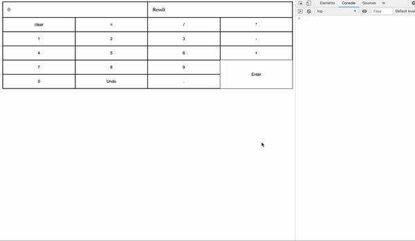
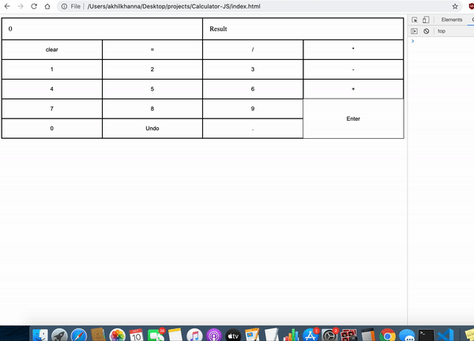

# Calculator 
Simple Calculator 

## Features
* Responsive by using CSS Grid layout 
* Calculator is able to add, subtract, multiply and divide
* Input window to show users ongoing expression to evaluate
* Result window to show result of each calculation
* Calculator respects order of operations (PEMDAS)
* Clear button that clears the most recent entry (Operand or Number)
* User can chain operations
* User can multiply negative numbers and replace previous operands with new operands
* Users can type there calculations but are only allowed to type valid operations i.e (no letters)
* User errors such as entering in invalid numbers i.e (50.21.10) are handled
## Demo



## Technologies
HTML<br/>
CSS<br/>
JavaScript<br/>

## Usage

```
    pull the repository and open index.html with any browser and start calculating!
```

